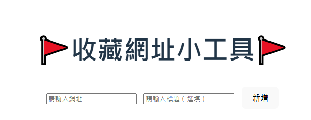

# 收藏網址小工具 VueHW

這是使用 Vue + JavaScript + Vite 開發的小工具，可收藏網址，並使用 localStorage 保留資料。

## 功能列表

- 新增網址收藏（可選填標題）
- 顯示所有已收藏網址
- 每筆可點擊開啟原始網站
- 支援刪除單筆收藏
- 一鍵清空所有收藏
- 使用 localStorage 保存(F12->Application->Storage->Local Storage查看)

## 使用方式

1. 輸入網址與標題
2. 點擊「新增」
3. 下方清單會出現新收藏
4. 點擊連結會開啟網站，or點「刪除」移除
5. 點「清空全部」可刪除所有收藏
6. 關閉瀏覽器也會保留儲存資料（localStorage）

## 技術細節

- Vue 
    - **Options API：** 使用 `data()`、`methods`、`watch`、`created()` 來構建功能。
    - **v-model：** 透過雙向綁定 (`v-model="url"` 和 `v-model="title"`) 綁定使用者輸入。
    - **v-for：** 迴圈顯示網址清單。
    - **v-if：** 當清單不為空時，顯示「清空全部」按鈕。
    - **事件綁定 @click：** 「新增」、「刪除」、「清空」等按鈕事件。
- JavaScript (Options API)
- Vite 作為開發環境
- localStorage 本地資料儲存
    - 使用 `localStorage.setItem()` 將網址清單儲存為 JSON 字串。
    - 使用 `localStorage.getItem()` 在頁面載入時，還原收藏資料。
    - 使用 `watch()` 監聽 `bookmarks` 陣列的變化，自動同步到 localStorage。

---

by Hank 

[def]: image.png